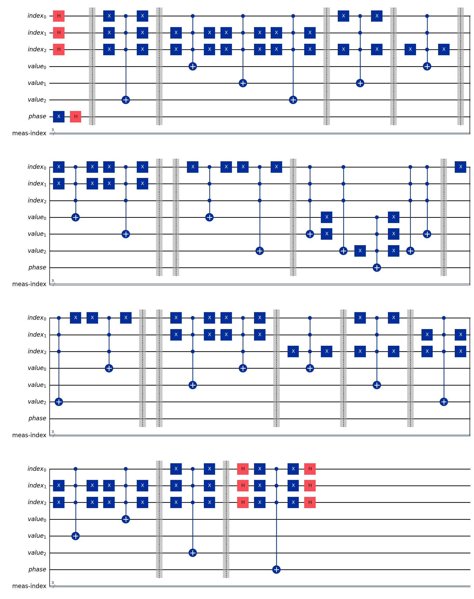

# ⚛ Quantum Search

## Example

Input:
```bash
python scripts/quantum-search.py --array_len 50
```

Output:
```
Input array: [13, 39, 30, 45, 17, 48, 26, 25, 32, 19, 12, 4, 37, 8, 3, 6, 41, 46, 47, 15
, 9, 16, 24, 34, 31, 0, 44, 27, 33, 5, 29, 11, 36, 1, 21, 2, 43, 35, 23, 40, 10, 22, 18,
 49, 20, 7, 42, 14, 28, 38]
Item to search: 32
Correct answer should be: 8
N qubits for index: 6
N qubits for value: 6
Num of grover iterations: 7
Search result, index: 8, empirical prob to collapse in this state: 0.90625
Prob to collapse into a correct state: 0.90625
```

## Circuit


This project is licensed under the MIT License – see the LICENSE.md file for details.

